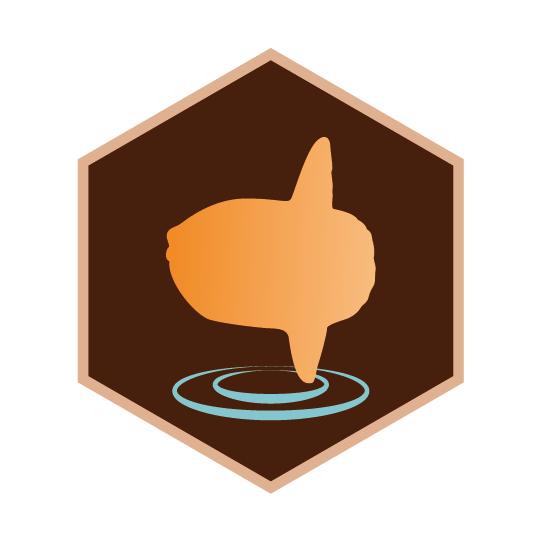
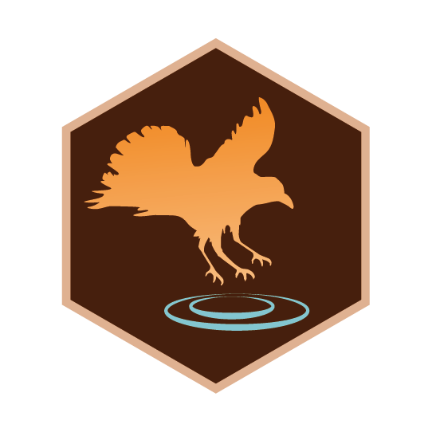
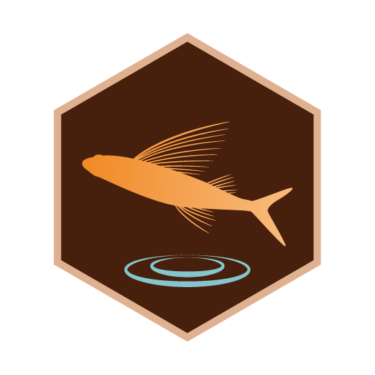
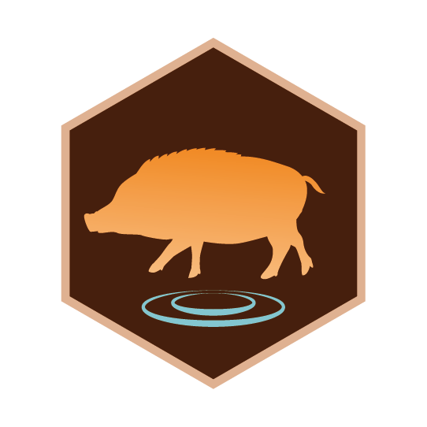

# SVG of ingress-like-medals
Ingress-like medals which describes symbolic characters(mainly animals or plants) for several cities in Japan.
Shdow shapes comes from mainly "http://kage-design.com/".

# contents
## Mie pref.
|Name in en|Name in jp|Caracters|image|
|:---------|:--------|:---------|:--:|
|Kihoku town|_紀北町_|sunfish||
|Kumano city|_熊野市_|lion rock||
|Mihama city|_御浜町_|mikan(some kinds of orange)||
|Kiho town|_紀宝町_|sea turtle||
|Shingu city|_新宮市_|Yatagarasu(raven with 3 legs)||
|Nachikatsuura town|_那智勝浦町_|tuna||
|Kushimoto town|_串本町_|flying fish||
|Susami town|_すさみ町_|domestic hybrid of boa and pig||